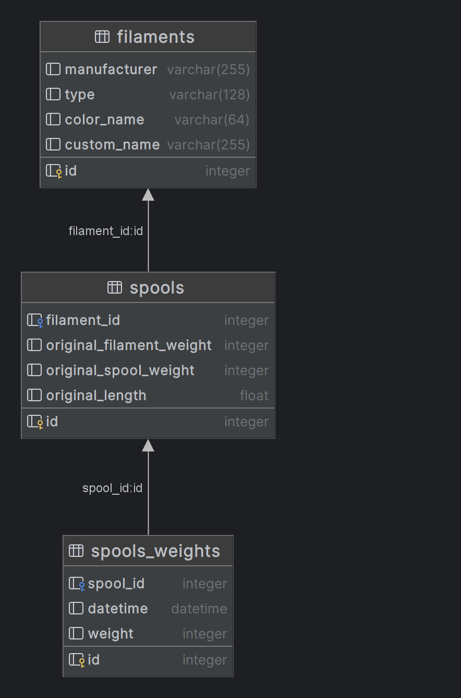

# Fillament management 

Manage 3D printing filament in Python CLI APP. 

This project is created as a project for Vives Kortrijk Python class **V5R301**

## What can this project do
- Manage filaments and spools
- calculate spool estimates for lenght using current weight
- export to excel file

## DB sturcture



## Setup project
1) install pip requirements from `requirements.txt`
```bash
pip install -r requirements.txt
```

2) Create and set options in `./config/.env`, you can use `./config/.env.example`
```bash
cp ./config/.env.example ./config/.env
```

3) Run Python script
```bash
python main.py
```